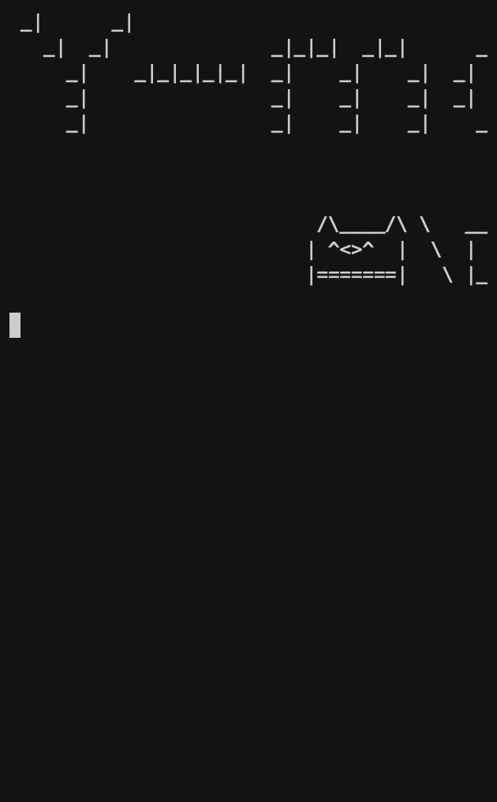

# faceWithShgif



A sample project to `simulate` live2D like character on Brick

This will be used as base of new repo

# build & run

```sh
# just build
$ stack build

# build & run
$ stack run
```


# usage

```yaml
$ stack run -- --help
faceWithShgif -- prototype program to do live2d like animation with shgif

Key control:
    q: quit program
    w: switch right eye
    e: switch left eye
    m: switch mouth
    l: look left
    h: look right
```
