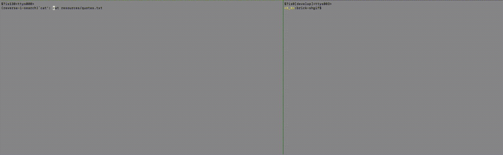

# qotd-hs

A simple 'Quote of the day' server written in Haskell

## References

  - [RFC865(Definition of Quote of the day)](https://tools.ietf.org/html/rfc865)
  - [Network.Socket -- Hackage](https://hackage.haskell.org/package/network-3.1.1.1/docs/Network-Socket.html)
  - http://agtn.hatenablog.com/entry/2015/07/23/214344
